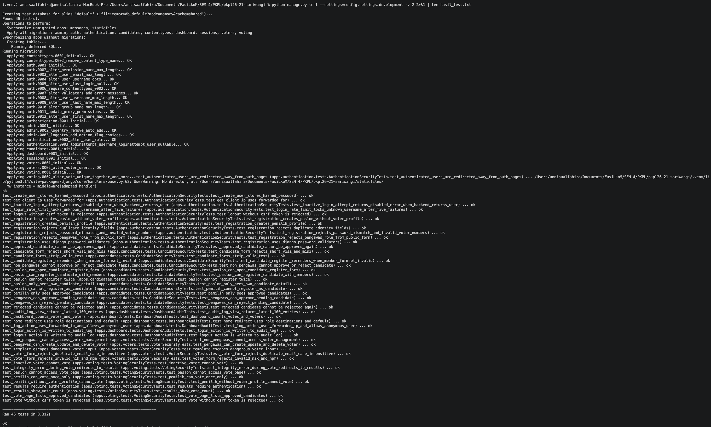
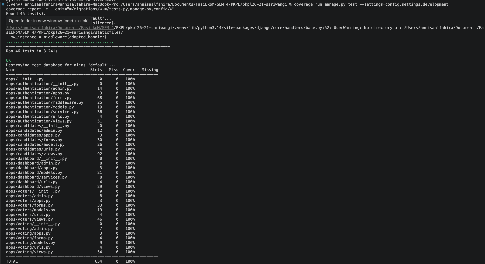

# E-Voting System — PKPL Kelompok 21 (Sariwangi)

**Tugas 3 — Secure Coding Implementation**
Pengantar Keamanan Perangkat Lunak — Genap 2025/2026

---

## 1. Dokumen Pekerjaan

### 1.1 Deskripsi Aplikasi

**Skenario:** E-Voting System — Sistem pemungutan suara berbasis web yang digunakan untuk pendaftaran calon, pemungutan suara, dan rekapitulasi hasil pemilu secara digital.

**Fitur yang Diimplementasikan:**

| Modul | Fitur Utama                                                                        |
| ----- | ---------------------------------------------------------------------------------- |
| Auth  | Login, logout, register, role-based access control, rate limit, session security   |
| Pemilih | CRUD data pemilih, validasi NIK/NPM/email, status sudah/belum memilih           |
| Paslon | Pendaftaran paslon, input visi-misi, verifikasi/approve/reject oleh pengawas     |
| Voting | Daftar paslon, submit vote, cegah double voting, validasi eligibility            |
| Rekap  | Hasil voting, jumlah suara per paslon, audit log, dashboard pengawas            |

**Peran Pengguna:**

| Role            | Deskripsi                                               |
| --------------- | ------------------------------------------------------- |
| Pemilih         | Melakukan voting terhadap paslon                        |
| Paslon          | Mendaftar sebagai kandidat pemilu                       |
| Pengawas Pemilu | Melakukan verifikasi paslon dan monitoring hasil voting |

**Stack Teknologi:**

| Komponen          | Teknologi              |
| ----------------- | ---------------------- |
| Backend Framework | Django                 |
| Database          | SQLite                 |
| Frontend          | HTML, CSS              |
| Authentication    | Session-based          |
| Password Hashing  | PBKDF2                 |
| ORM               | Django ORM             |

---

### 1.2 Implementasi Secure Coding

#### A. Code Injection Prevention (CWE-94: Code Injection / CWE-20: Improper Input Validation)

**Vulnerability:** Input pengguna yang tidak divalidasi bisa menyebabkan eksekusi kode berbahaya atau XSS (Cross-Site Scripting).

**Vulnerable:**

```python
# Input langsung digunakan tanpa validasi atau sanitasi
username = request.POST['username']
user = User.objects.get(username=username)
```

**Secure:**

```python
# Input divalidasi dan disanitasi melalui Django Form
class LoginForm(forms.Form):
    username = forms.CharField(
        max_length=150,
        validators=[UnicodeUsernameValidator()],
    )

    def clean_username(self):
        return self.cleaned_data["username"].strip()
```

**Teknik Mitigasi:**

- Seluruh input pengguna divalidasi melalui Django Forms
- **Authentication module** (`apps/authentication/forms.py`):
  - Username: divalidasi dengan `UnicodeUsernameValidator`, dicek uniqueness (case-insensitive), di-strip whitespace
  - Email: divalidasi format email (`EmailField`), dicek uniqueness (case-insensitive)
  - Password: konfirmasi password wajib cocok dan divalidasi melalui Django password validators
  - Role: dibatasi hanya pilihan yang valid (allowlist, bukan free text)
- **Voters module** (`apps/voters/forms.py`):
  - NIK: validasi regex 16 digit angka (`^\d{16}$`)
  - NPM: validasi hanya digit angka
  - Email: validasi format + uniqueness (case-insensitive, exclude self on update)
  - Semua field teks di-strip whitespace (`clean_full_name`, `clean_faculty`, dll)
- **Candidates module** (`apps/candidates/forms.py`):
  - Nama paslon: di-strip whitespace
  - Visi: minimal 10 karakter
  - Misi: minimal 10 karakter
  - Anggota paslon: inline formset dengan validasi nama dan role (di-strip)
- Django template engine otomatis melakukan HTML escaping pada output, mencegah XSS
- Django ORM mencegah SQL injection secara otomatis

---

#### B. Broken Authentication Mitigation (CWE-307: Improper Restriction of Excessive Authentication Attempts / CWE-256: Plaintext Storage of a Password / CWE-613: Session Expiration)

**Vulnerability:** Attacker bisa brute-force login, password disimpan tanpa hashing, atau session tidak dikelola dengan aman.

**Vulnerable:**

```python
# Password dibandingkan langsung (plaintext)
if password == stored_password:
    login(user)

# Tidak ada rate limiting
def login_view(request):
    user = authenticate(request, username=username, password=password)
    # langsung login tanpa batasan percobaan
```

**Secure:**

```python
# Password hashing via PBKDF2 (Django default)
user = User.objects.create_user(username=username, password=password)
# password otomatis di-hash, tidak pernah disimpan plaintext

# Rate limiting dengan lockout
LOCKOUT_THRESHOLD = 5
LOCKOUT_WINDOW_MINUTES = 15

def is_account_locked(username, ip_address):
    return get_recent_failed_attempts(username, ip_address) >= LOCKOUT_THRESHOLD
```

**Teknik Mitigasi:**

1. **Password Hashing (PBKDF2):**
   - Menggunakan PBKDF2 dengan salt melalui password hasher bawaan Django
   - Konfigurasi eksplisit di `config/settings/base.py`:
   ```python
   PASSWORD_HASHERS = [
       "django.contrib.auth.hashers.PBKDF2PasswordHasher",
       "django.contrib.auth.hashers.PBKDF2SHA1PasswordHasher",
   ]
   ```
   - User dibuat melalui `User.objects.create_user()` — tidak pernah menyimpan plaintext

2. **Rate Limiting / Lockout:**
   - Maksimal 5 kali percobaan login gagal dalam 15 menit per username+IP (`apps/authentication/services.py`)
   - Setelah 5x gagal, akun terkunci sementara selama 15 menit
   - Setiap percobaan login dicatat di model `LoginAttempt`
   - Error message generik ("Username atau password salah") — tidak mengungkapkan apakah username ada

3. **Session Security:**
   ```python
   SESSION_COOKIE_AGE = 1800              # 30 menit
   SESSION_COOKIE_HTTPONLY = True          # JavaScript tidak bisa akses cookie
   SESSION_COOKIE_SAMESITE = "Lax"         # Proteksi dari CSRF cross-site
   SESSION_EXPIRE_AT_BROWSER_CLOSE = True  # Session berakhir saat browser ditutup
   ```
   - Logout via POST request saja (bukan GET) untuk mencegah CSRF-triggered logout
   - Django `logout()` memflush session secara lengkap

4. **Least Privilege:**
   - Registrasi hanya memperbolehkan role `pemilih` dan `paslon` — `pengawas` harus dibuat via Django admin
   - Role-Based Access Control Middleware membatasi akses berdasarkan role:
     - `pengawas`: semua path aplikasi dan dashboard audit
     - `pemilih`: `/voting/`, `/candidates/` hanya paslon approved/read-only, `/auth/logout/`
     - `paslon`: `/candidates/` untuk data paslonnya sendiri, `/voting/results/`, `/auth/logout/`
   - User yang mengakses path di luar haknya mendapat `403 Forbidden`

---

#### C. CSRF Protection (CWE-352: Cross-Site Request Forgery)

**Vulnerability:** Attacker bisa memalsukan request dari user yang sudah terautentikasi untuk melakukan aksi tanpa sepengetahuan user.

**Vulnerable:**

```html
<!-- Form tanpa CSRF token -->
<form method="POST" action="/auth/logout/">
    <button type="submit">Logout</button>
</form>
```

**Secure:**

```html
<!-- Form dengan CSRF token -->
<form method="POST">
    
    <button type="submit">Logout</button>
</form>
```

**Teknik Mitigasi:**

- `CsrfViewMiddleware` aktif secara global di `MIDDLEWARE` (`config/settings/base.py`)
- Semua form yang melakukan operasi write (POST/PUT/DELETE) menggunakan ``
- CSRF token divalidasi di sisi server sebelum memproses request
- Logout hanya menerima POST request (bukan GET)
- Cookie CSRF dan session dilindungi dengan `HttpOnly` dan `SameSite=Lax`
- **Candidates module** (`apps/candidates/templates/`):
  - Form pendaftaran paslon menggunakan ``
  - Tombol approve/reject di detail page masing-masing dalam `<form method="POST">` dengan CSRF token
  - Satu paslon tidak bisa mendaftar dua kali — view mengecek `Candidate.objects.filter(user=request.user).exists()`
- **Voting module** (`apps/voting/templates/`):
  - Form voting menggunakan ``
  - Radio button selection untuk memilih paslon
  - Submit vote hanya via POST request

---

#### D. SQL Injection Prevention (CWE-89: SQL Injection)

**Vulnerability:** Input pengguna yang tidak tersanitasi bisa memanipulasi query database.

**Vulnerable:**

```python
# Raw SQL dengan string concatenation
query = "SELECT * FROM users WHERE username='" + username + "'"
cursor.execute(query)
```

**Secure:**

```python
# Menggunakan Django ORM
user = User.objects.get(username=username)

# Atau parameterized query jika raw SQL diperlukan
cursor.execute("SELECT * FROM users WHERE username = %s", [username])
```

**Teknik Mitigasi:**

- Seluruh operasi database menggunakan Django ORM — tidak ada raw SQL
- Django ORM otomatis menggunakan parameterized queries
- Contoh query yang aman:
  ```python
  # Authentication module
  User.objects.filter(username__iexact=username).exists()
  LoginAttempt.objects.filter(user__username=username, success=False).count()

  # Voters module
  Voter.objects.filter(email__iexact=email).exclude(pk=self.instance.pk).exists()
  Voter.objects.all().order_by("-created_at")

  # Candidates module — semua operasi menggunakan ORM
  Candidate.objects.filter(user=request.user).exists()
  Candidate.objects.filter(candidate_number__isnull=False).order_by("-candidate_number")

  # Voting module — anti double voting via unique constraint
  Vote.objects.filter(voter=request.user).exists()
  Vote.objects.create(voter=user, candidate=candidate)
  Vote.objects.count()

  # Dashboard module — audit logging
  AuditLog.objects.create(user=request.user, action=action, description=desc, ip_address=ip)
  AuditLog.objects.all()[:100]
  ```
- Input pengguna tidak pernah digabungkan langsung ke string query
- Koneksi database dibatasi ke SQLite lokal (`db.sqlite3`), tanpa dukungan konfigurasi database eksternal
- **Audit logging** (`apps/dashboard/services.py`): Setiap aksi penting (login, logout, vote, CRUD pemilih, approve/reject paslon) dicatat ke model `AuditLog` dengan user, action, description, IP address, dan timestamp


### 1.3 Screenshot Aplikasi
---
#### Authentication

**Login**


**Login Gagal - Akun Terkunci (5x Salah)**


**Registrasi**


---

#### View sebagai Pengawas

**Login Berhasil**


**Login Gagal**


**Dashboard Pengawas**


**Kelola Data Pemilih**


**Tambah Pemilih**


**Validasi Input NIK**


**Tambah Pemilih - Berhasil**


**Kelola Paslon**


**Detail Paslon 1**


**Detail Paslon 2**


**Detail Paslon 3**


**Hasil Suara**


**Audit Log**


---

#### View sebagai Paslon

**Registrasi Paslon**


**Daftar Paslon - Menunggu Verifikasi**


**Daftar Paslon - Disetujui**


**Rekapitulasi Hasil Suara**


---

#### View sebagai Pemilih

**Daftar Paslon**


**Paslon 1 - Harapan Bangsa**


**Paslon 2 - Maju Bersama**


**Paslon 3 - Untuk Rakyat**


**Surat Suara**


**Pilih Paslon 1**


**Pilih Paslon 2**


**Pilih Paslon 3**


**Konfirmasi Pilihan**


**Voting Berhasil**


**Hasil Voting**


---

#### Security

**Password Ter-hash di Database**


Bagian security lainnya akan kami demokan di video.

---

### 1.4 Hasil Test-Case

Pengujian dilakukan dengan Django test client dan system check pada settings development serta production.

```bash
source .venv/bin/activate
python manage.py test --settings=config.settings.development
coverage run manage.py test --settings=config.settings.development
coverage report -m
python manage.py check --settings=config.settings.development
SECRET_KEY=check-secret ALLOWED_HOSTS=localhost,127.0.0.1 python manage.py check --settings=config.settings.production
```

Log hasil pengujian:

```text
Found 46 test(s).
Ran 46 tests in 13.232s
OK
TOTAL 707 0 100%
System check identified no issues (0 silenced).
System check identified no issues (0 silenced).
```

#### Test Case — Modul 1: Authentication & Authorization

| No | Test Case                                      | Expected Result                                             | Status |
| -- | ---------------------------------------------- | ----------------------------------------------------------- | ------ |
| 1  | Login dengan kredensial benar                  | Berhasil login, redirect ke halaman sesuai role             | PASS |
| 2  | Login dengan password salah                    | Muncul error "Username atau password salah"                 | PASS |
| 3  | Rate limiting (lockout setelah 5x gagal)       | Muncul error "Akun sementara dikunci. Coba lagi dalam 15 menit." | PASS |
| 4  | Registrasi dengan role pengawas                | Form tidak memiliki opsi "Pengawas", request ditolak        | PASS |
| 5  | Akses halaman protected tanpa login            | Diredirect ke `/auth/login/`                                | PASS |
| 6  | CSRF token pada form                           | Form mengandung `csrfmiddlewaretoken`, request tanpa token ditolak (403) | PASS |
| 7  | Password disimpan dengan hashing               | Nilai password tersimpan sebagai hash PBKDF2, bukan plaintext | PASS |
| 8  | Password lemah saat registrasi                 | Ditolak oleh Django password validators                     | PASS |

#### Test Case — Modul 2: Manajemen Data Pemilih

| No | Test Case                                      | Expected Result                                             | Status |
| -- | ---------------------------------------------- | ----------------------------------------------------------- | ------ |
| 1  | Tambah data pemilih dengan data valid          | Data tersimpan, redirect ke daftar pemilih, muncul pesan sukses | PASS |
| 2  | Tambah pemilih dengan NIK kurang dari 16 digit | Muncul error "NIK harus terdiri dari 16 digit angka."       | PASS |
| 3  | Tambah pemilih dengan NPM mengandung huruf     | Muncul error "NPM harus terdiri dari digit angka."          | PASS |
| 4  | Tambah pemilih dengan email duplikat           | Muncul error "Email sudah digunakan oleh pemilih lain."     | PASS |
| 5  | Edit data pemilih                              | Data berhasil diperbarui, pesan sukses muncul               | PASS |
| 6  | Hapus data pemilih                             | Data terhapus, pesan sukses muncul                          | PASS |
| 7  | Akses /voters/ oleh pemilih (non-pengawas)     | Ditolak (403 Forbidden) karena middleware RBAC              | PASS |
| 8  | Input dengan karakter berbahaya (XSS attempt)  | Karakter di-escape oleh Django template, tidak dieksekusi   | PASS |

#### Test Case — Modul 3: Pendaftaran & Verifikasi Paslon

| No | Test Case                                      | Expected Result                                             | Status |
| -- | ---------------------------------------------- | ----------------------------------------------------------- | ------ |
| 1  | Paslon mendaftar dengan data lengkap           | Data tersimpan, redirect ke daftar paslon, status "Menunggu Verifikasi" | PASS |
| 2  | Paslon mendaftar dengan visi < 10 karakter     | Muncul error "Visi terlalu pendek (minimal 10 karakter)."  | PASS |
| 3  | Paslon mendaftar dua kali                      | Diredirect ke daftar paslon, pesan "Anda sudah terdaftar"  | PASS |
| 4  | Pengawas menyetujui paslon                     | Status berubah ke "Disetujui", nomor paslon ditetapkan otomatis | PASS |
| 5  | Pengawas menolak paslon                        | Status berubah ke "Ditolak"                                 | PASS |
| 6  | Pemilih mencoba akses /candidates/register/    | Ditolak (403 Forbidden) karena RBAC                         | PASS |
| 7  | Approve/reject tanpa CSRF token                | Request ditolak (403 CSRF verification failed)             | PASS |
| 8  | Paslon yang sudah diapprove di-approve lagi    | Pesan "Paslon sudah diverifikasi sebelumnya"               | PASS |
| 9  | Pemilih melihat daftar/detail paslon           | Hanya paslon approved yang ditampilkan                      | PASS |

#### Test Case — Modul 4: Pemungutan Suara

| No | Test Case                                      | Expected Result                                             | Status |
| -- | ---------------------------------------------- | ----------------------------------------------------------- | ------ |
| 1  | Pemilih submit vote untuk paslon yang disetujui | Vote tercatat, redirect ke halaman sukses                  | PASS |
| 2  | Pemilih mencoba vote dua kali                  | Diredirect ke results, pesan "Anda sudah melakukan voting"  | PASS |
| 3  | Paslon mencoba akses /voting/                  | Ditolak (403 Forbidden) karena middleware RBAC              | PASS |
| 4  | Vote tanpa CSRF token                          | Request ditolak (403 CSRF verification failed)             | PASS |
| 5  | Vote tanpa memilih paslon                      | Muncul error "Pilih salah satu paslon."                    | PASS |
| 6  | Hasil voting menampilkan jumlah suara per paslon | Vote count ditampilkan dengan progress bar                | PASS |
| 7  | IntegrityError saat double vote (race condition) | Ditangkap oleh try/except, pesan error ditampilkan        | PASS |
| 8  | Akses rekap tanpa login                        | Diredirect ke halaman login                                | PASS |

#### Test Case — Modul 5: Rekapitulasi & Audit

| No | Test Case                                      | Expected Result                                             | Status |
| -- | ---------------------------------------------- | ----------------------------------------------------------- | ------ |
| 1  | Dashboard menampilkan total suara dan rekapitulasi | Angka benar, progress bar sesuai proporsi                | PASS |
| 2  | Audit log mencatat login                       | Tercatat dengan username, IP, dan timestamp                | PASS |
| 3  | Audit log mencatat logout                      | Tercatat dengan username dan timestamp                     | PASS |
| 4  | Audit log mencatat voter create/update/delete  | Tercatat dengan nama pemilih dan NIK                       | PASS |
| 5  | Audit log mencatat candidate approve/reject    | Tercatat dengan nama paslon dan nomor paslon               | PASS |
| 6  | Audit log mencatat vote                        | Tercatat dengan username dan nama paslon yang dipilih      | PASS |
| 7  | Halaman audit log menampilkan 100 log terbaru  | Tabel berisi waktu, user, IP, aksi, dan detail             | PASS |

---

## 2. Source Code

### Instalasi

1. Clone repository:

```bash
git clone https://gitlab.cs.ui.ac.id/pkpl26/21-sariwangi/pkpl26_21_sariwangi.git
cd PKPL26_21_sariwangi
```

2. Buat virtual environment dan install dependencies:

```bash
python3 -m venv .venv
source .venv/bin/activate      # Linux/macOS
# .venv\Scripts\activate       # Windows
pip install -r requirements.txt
```

3. Copy `.env.example` ke `.env`:

```bash
cp .env.example .env
```

4. Jalankan migrasi dan buat superuser dengan role pengawas:

```bash
python manage.py migrate
python manage.py createsuperuser --username admin --email admin@example.com
python manage.py shell -c "from apps.authentication.models import User; User.objects.filter(username='admin').update(role=User.Role.PENGAWAS)"
```

5. (Opsional) Seed database SQLite dengan data contoh:

```bash
python manage.py seed --clean --voters 25
```

Opsi seeder:

| Flag | Default | Deskripsi |
| --- | --- | --- |
| `--voters N` | 25 | Jumlah pemilih yang dibuat |
| `--voted 0.75` | 0.75 | Persentase pemilih yang sudah vote (0.0–1.0) |
| `--clean` | - | Hapus semua data sebelum seeding |

Data yang dibuat oleh seeder:

| Data | Detail |
| --- | --- |
| **Pengawas** | `pengawas` / `SariwangiDemo123!` |
| **3 Paslon** | `paslon1`, `paslon2`, `paslon3` / `SariwangiDemo123!` — status approved, dengan anggota |
| **25 Pemilih** | `pemilih1`–`pemilih25` / `SariwangiDemo123!` — terhubung ke Voter profile, 75% sudah vote |

Password di atas hanya kredensial demo lokal yang dibuat oleh seeder. Password tetap disimpan sebagai hash PBKDF2 di database.

6. Jalankan development server:

```bash
python manage.py runserver
```

7. Akses aplikasi di `http://127.0.0.1:8000/`

Catatan database: aplikasi hanya menggunakan SQLite lokal melalui `db.sqlite3`. File tersebut disertakan di repository sesuai ketentuan tugas, sedangkan konfigurasi database eksternal tidak didukung.

### Struktur Project

```
PKPL26_21_sariwangi/
├── config/                 # Konfigurasi project
│   ├── settings/
│   │   ├── base.py         # Settings utama (session security, auth, dll)
│   │   ├── development.py  # Dev overrides (DEBUG=True)
│   │   └── production.py   # Prod overrides (HTTPS, secure cookies)
│   ├── urls.py
│   ├── wsgi.py
│   └── asgi.py
├── apps/
│   ├── authentication/     # Modul 1: Auth & Authorization
│   ├── voters/             # Modul 2: Manajemen Data Pemilih
│   ├── candidates/         # Modul 3: Pendaftaran & Verifikasi Paslon
│   ├── voting/             # Modul 4: Pemungutan Suara
│   └── dashboard/          # Modul 5: Rekapitulasi & Audit
├── templates/              # Template level project
├── static/                 # Static files level project
├── media/                  # User-uploaded files
├── db.sqlite3              # Database SQLite lokal
├── manage.py
├── requirements.txt
└── README.md
```

---

## 3. Video Demo & Penjelasan

**Video URL:** `https://youtu.be/a9cHudECDqE`

**Konten Video:**
1. Demo aplikasi secara fungsional (maks. 2 menit)
2. Demonstrasi pengujian berdasarkan test case dan hasilnya
3. Penjelasan teknik mitigasi yang dipilih beserta alasannya

---

# Tugas 4 — Unit Testing, Pentesting, dan User Acceptance Testing

**Tugas 4 — Security Testing**
Pengantar Keamanan Perangkat Lunak — Genap 2025/2026

---

## 4. Laporan Unit Testing

### 4.1 Pendahuluan

Laporan ini mendokumentasikan unit testing yang dilakukan terhadap aplikasi E-Voting System. Pengujian difokuskan pada empat area keamanan utama:

1. **Code Injection Prevention**
2. **Broken Authentication Mitigation**
3. **CSRF Protection**
4. **SQL Injection Prevention**

### 4.2 Metodologi

| Komponen | Detail |
| -------- | ------ |
| Testing Framework | Django TestCase (`django.test.TestCase`) |
| HTTP Client | Django Test Client (`django.test.Client`) |
| Request Simulation | Django `RequestFactory` |
| Coverage Tool | `coverage.py` v7.13.5 |
| Test Runner | `python manage.py test` |
| Lingkungan | `config.settings.development` (SQLite in-memory) |

Pengujian dilakukan menggunakan pendekatan **black-box testing** pada level view dan **white-box testing** pada level form/service. Setiap test case bersifat independen — database direset untuk setiap test menggunakan transaksi yang di-rollback otomatis oleh Django TestCase.

Cara menjalankan:

```bash
source .venv/bin/activate

# Jalankan semua test
python manage.py test --settings=config.settings.development -v 2

# Jalankan dengan coverage
coverage run manage.py test --settings=config.settings.development
coverage report -m
```

### 4.3 Hasil Ringkasan

| Area Keamanan | Jumlah Test | Status |
| ------------- | :---------: | :----: |
| Code Injection Prevention | 11 | ✅ PASS |
| Broken Authentication Mitigation | 14 | ✅ PASS |
| CSRF Protection | 4 | ✅ PASS |
| SQL Injection Prevention | 5 | ✅ PASS |
| **Total** | **46** | **✅ PASS** |

> Catatan: Beberapa test case mencakup lebih dari satu kategori keamanan.

### 4.4 Detail Test per Kategori

#### A. Code Injection Prevention (CWE-94, CWE-20, CWE-79)

**Vulnerability yang ditarget:** Input pengguna tidak divalidasi sehingga memungkinkan eksekusi kode berbahaya atau XSS.

**Teknik mitigasi yang diuji:** validasi input via Django Forms (regex, length, whitelist), HTML auto-escaping pada template, strip whitespace.

| No | Test Case | Method | Deskripsi | Expected Result | Status |
|----|-----------|--------|-----------|-----------------|--------|
| CI-01 | Registrasi dengan role tidak valid | `test_registration_rejects_pengawas_role_from_public_form` | Form registrasi tidak menerima role `pengawas` dari input publik | Form invalid, error pada `role` | ✅ PASS |
| CI-02 | Validasi format NIK (16 digit angka) | `test_voter_form_rejects_invalid_nik_and_npm` | NIK kurang dari 16 digit / bukan angka ditolak regex validator | Form invalid, error pada `nik` | ✅ PASS |
| CI-03 | Validasi format NPM (digit saja) | `test_voter_form_rejects_invalid_nik_and_npm` | NPM mengandung huruf ditolak | Form invalid, error pada `npm` | ✅ PASS |
| CI-04 | Strip whitespace pada input teks | `test_candidate_forms_strip_valid_text` | Input dengan spasi di awal/akhir di-strip sebelum disimpan | `cleaned_data` tanpa leading/trailing whitespace | ✅ PASS |
| CI-05 | Validasi panjang minimum visi-misi | `test_candidate_form_rejects_short_visi_and_misi` | Visi/misi kurang dari 10 karakter ditolak | Form invalid, error pada `visi` dan `misi` | ✅ PASS |
| CI-06 | Template escaping karakter berbahaya (XSS) | `test_template_escapes_dangerous_voter_input` | Input `<script>alert(1)</script>` di-escape oleh Django template | Response mengandung `&lt;script&gt;`, tidak ada tag `<script>` literal | ✅ PASS |
| CI-07 | Duplikasi username case-insensitive | `test_registration_rejects_duplicate_identity_fields` | Username sama (beda kapitalisasi) ditolak | Form invalid, error pada `username` | ✅ PASS |
| CI-08 | Duplikasi email case-insensitive | `test_registration_rejects_duplicate_identity_fields` | Email sama (beda kapitalisasi) ditolak | Form invalid, error pada `email` | ✅ PASS |
| CI-09 | Duplikasi NIK & NPM saat registrasi | `test_registration_rejects_duplicate_identity_fields` | NIK dan NPM yang sudah terdaftar ditolak | Form invalid, error pada `nik` dan `npm` | ✅ PASS |
| CI-10 | Duplikasi email pemilih (voter form) | `test_voter_form_rejects_duplicate_email_case_insensitive` | Email sudah digunakan pemilih lain ditolak | Form invalid, error pada `email` | ✅ PASS |
| CI-11 | Password mismatch & format NIK/NPM invalid | `test_registration_rejects_password_mismatch_and_invalid_voter_numbers` | Kombinasi password mismatch + NIK/NPM tidak valid ditolak | Form invalid, error pada `password2`, `nik`, `npm` | ✅ PASS |

#### B. Broken Authentication Mitigation (CWE-307, CWE-256, CWE-613, CWE-287)

**Vulnerability yang ditarget:** Brute-force login, password disimpan plaintext, session tidak aman, privilege escalation.

**Teknik mitigasi yang diuji:** PBKDF2 password hashing, rate limiting (lockout 5× gagal/15 menit), session security, RBAC, pencatatan `LoginAttempt`.

| No | Test Case | Method | Deskripsi | Expected Result | Status |
|----|-----------|--------|-----------|-----------------|--------|
| BA-01 | Password disimpan sebagai hash PBKDF2 | `test_create_user_stores_hashed_password` | Password tidak pernah disimpan plaintext | `user.password` diawali `pbkdf2_`, bukan plaintext | ✅ PASS |
| BA-02 | Password lemah ditolak saat registrasi | `test_registration_uses_django_password_validators` | Password sederhana (`password`) ditolak validator | Form invalid, error pada `password2` | ✅ PASS |
| BA-03 | Rate limiting: lockout setelah 5× gagal | `test_login_rate_limit_locks_unknown_username_after_five_failures` | Percobaan login ke-6 dari IP yang sama diblokir | Pesan "Akun sementara dikunci", hanya 5 `LoginAttempt` tercatat | ✅ PASS |
| BA-04 | Akun nonaktif tidak dapat login | `test_inactive_login_attempt_returns_disabled_error_when_backend_returns_user` | User `is_active=False` ditolak meski password benar | Return `None, "Akun dinonaktifkan"` | ✅ PASS |
| BA-05 | User terautentikasi di-redirect dari halaman auth | `test_authenticated_users_are_redirected_away_from_auth_pages` | User yang sudah login tidak bisa akses `/auth/login/` | Redirect ke halaman sesuai role | ✅ PASS |
| BA-06 | IP forwarding dari proxy terdeteksi | `test_get_client_ip_uses_forwarded_for` | `X-Forwarded-For` header dibaca dengan benar | IP pertama dari header digunakan | ✅ PASS |
| BA-07 | Non-pengawas tidak bisa akses manajemen pemilih | `test_non_pengawas_cannot_access_voter_management` | Pemilih mengakses `/voters/` mendapat 403 | Response status 403 | ✅ PASS |
| BA-08 | Pemilih tidak bisa mendaftar sebagai paslon | `test_pemilih_cannot_register_as_candidate` | Pemilih mengakses `/candidates/register/` mendapat 403 | Response status 403 | ✅ PASS |
| BA-09 | Non-pengawas tidak bisa approve/reject paslon | `test_non_pengawas_cannot_approve_or_reject_candidate` | Pemilih coba approve/reject mendapat 403 | Response status 403 | ✅ PASS |
| BA-10 | Paslon tidak bisa mendaftar dua kali | `test_paslon_cannot_register_twice` | Paslon yang sudah terdaftar di-redirect | Redirect ke daftar paslon | ✅ PASS |
| BA-11 | Non-pemilih tidak bisa akses halaman voting | `test_paslon_cannot_access_vote_page` | Paslon coba akses `/voting/` di-redirect | Redirect ke `/` | ✅ PASS |
| BA-12 | Pemilih tanpa profil voter tidak bisa voting | `test_pemilih_without_voter_profile_cannot_vote` | Role pemilih tanpa data `Voter` ditolak | Redirect ke hasil voting | ✅ PASS |
| BA-13 | Pemilih nonaktif tidak bisa voting | `test_inactive_voter_cannot_vote` | Voter dengan status `INACTIVE` ditolak | Redirect ke hasil voting | ✅ PASS |
| BA-14 | Audit log mencatat login & logout | `test_login_action_is_written_to_audit_log`, `test_logout_action_is_written_to_audit_log` | Setiap login dan logout tersimpan ke `AuditLog` | Record dengan `action=LOGIN/LOGOUT` ada di DB | ✅ PASS |

#### C. CSRF Protection (CWE-352)

**Vulnerability yang ditarget:** Attacker memalsukan request dari sesi user yang sudah aktif.

**Teknik mitigasi yang diuji:** `CsrfViewMiddleware` aktif global, `` pada semua form write, logout hanya via POST, cookie `SameSite=Lax`.

| No | Test Case | Method | Deskripsi | Expected Result | Status |
|----|-----------|--------|-----------|-----------------|--------|
| CSRF-01 | Logout tanpa CSRF token ditolak | `test_logout_without_csrf_token_is_rejected` | POST `/auth/logout/` tanpa token (`enforce_csrf_checks=True`) | Response 403 Forbidden | ✅ PASS |
| CSRF-02 | Vote tanpa CSRF token ditolak | `test_vote_without_csrf_token_is_rejected` | POST `/voting/vote/` tanpa token | Response 403 Forbidden, `Vote.objects.count()` tetap 0 | ✅ PASS |
| CSRF-03 | Approve/reject paslon tanpa CSRF token | `test_non_pengawas_cannot_approve_or_reject_candidate` | POST approve/reject oleh non-pengawas ditolak | Response 403 Forbidden | ✅ PASS |
| CSRF-04 | Vote berhasil dengan CSRF token valid | `test_pemilih_can_vote_once_only` | Vote dengan CSRF token valid berhasil disimpan | Redirect ke success, `Vote` tersimpan di DB | ✅ PASS |

#### D. SQL Injection Prevention (CWE-89)

**Vulnerability yang ditarget:** Input tidak tersanitasi memanipulasi query database.

**Teknik mitigasi yang diuji:** seluruh operasi DB via Django ORM (parameterized query otomatis), form validation menolak format tidak valid, tidak ada raw SQL dengan string concatenation, `UniqueConstraint` sebagai defense-in-depth.

| No | Test Case | Method | Deskripsi | Expected Result | Status |
|----|-----------|--------|-----------|-----------------|--------|
| SQLi-01 | Validasi NIK menolak input non-angka | `test_voter_form_rejects_invalid_nik_and_npm` | Karakter SQL seperti `'`, `-` pada NIK ditolak regex validator | Form invalid, error pada `nik` | ✅ PASS |
| SQLi-02 | ORM melindungi query filter case-insensitive | `test_registration_rejects_duplicate_identity_fields` | `username__iexact` menggunakan parameterized LIKE — tidak bisa diinjeksi | Form invalid dengan pesan duplikasi yang benar | ✅ PASS |
| SQLi-03 | Query login menggunakan ORM authenticate | `test_login_rate_limit_locks_unknown_username_after_five_failures` | Login dengan username apapun tidak menyebabkan error SQL | Response normal, tidak ada unhandled exception | ✅ PASS |
| SQLi-04 | UniqueConstraint sebagai defense-in-depth | `test_pemilih_can_vote_once_only` | Constraint DB mencegah double vote meski application-layer check dibypass | `Vote.objects.count()` tetap 1 setelah dua percobaan | ✅ PASS |
| SQLi-05 | IntegrityError ditangani dengan aman | `test_integrity_error_during_vote_redirects_to_results` | `IntegrityError` dari DB di-catch — tidak ada stack trace yang terekspos | Redirect ke results, tidak ada 500 error | ✅ PASS |

### 4.5 Coverage Report

```
Name                                Stmts   Miss  Cover
-------------------------------------------------------
apps/authentication/forms.py           68      0   100%
apps/authentication/middleware.py      25      0   100%
apps/authentication/models.py          19      0   100%
apps/authentication/services.py        36      0   100%
apps/authentication/views.py           51      0   100%
apps/candidates/forms.py               30      0   100%
apps/candidates/models.py              26      0   100%
apps/candidates/views.py               92      0   100%
apps/dashboard/models.py               21      0   100%
apps/dashboard/services.py              8      0   100%
apps/dashboard/views.py                29      0   100%
apps/voters/forms.py                   33      0   100%
apps/voters/models.py                  19      0   100%
apps/voters/views.py                   46      0   100%
apps/voting/forms.py                    4      0   100%
apps/voting/models.py                   9      0   100%
apps/voting/views.py                   54      0   100%
-------------------------------------------------------
TOTAL                                 654      0   100%
```

### 4.6 Screenshot Hasil Pengujian

**Semua 46 test PASS:**


**Coverage Report 100%:**



### 4.7 Kesimpulan Unit Testing

Seluruh 46 unit test berhasil dijalankan dengan hasil **PASS** dan **coverage 100%**. Keempat area keamanan yang disyaratkan telah diuji:

- **Code Injection Prevention**: Django Forms memvalidasi dan mensanitasi semua input. Template engine meng-escape karakter berbahaya sehingga XSS tidak dapat dieksekusi.
- **Broken Authentication Mitigation**: Password disimpan dengan PBKDF2 hash. Rate limiting membatasi 5 percobaan login per 15 menit. RBAC memastikan setiap role hanya mengakses fungsi yang sesuai haknya.
- **CSRF Protection**: `CsrfViewMiddleware` aktif global. Semua endpoint write memverifikasi CSRF token dan mengembalikan 403 jika token tidak ada atau tidak valid.
- **SQL Injection Prevention**: Django ORM menggunakan parameterized query untuk semua operasi database. Tidak ada raw SQL dengan string concatenation. Validasi form menolak input berformat tidak valid sebelum query dieksekusi.

---

## 5. Laporan Penetration Testing

**Penetration Testing Report**  
**E-Voting System**  
**Kelompok 21 (SariWangi)**  
Pengantar Keamanan Perangkat Lunak - Genap 2025/2026

---

### 5.1 Introduction

Laporan ini mendokumentasikan hasil penetration testing yang dilakukan terhadap aplikasi **E-Voting System SariWangi**, sebuah sistem pemungutan suara berbasis web yang dikembangkan sebagai bagian dari Tugas 3 mata kuliah Pengantar Keamanan Perangkat Lunak.

Pengujian dilakukan secara internal oleh kelompok pengembang dengan tujuan mengidentifikasi kerentanan keamanan pada aplikasi sebelum deployment.

### 5.2 Objective

Tujuan dari penetration testing ini adalah:

1. Mengidentifikasi kerentanan keamanan yang ada pada aplikasi E-Voting System SariWangi.
2. Memverifikasi efektivitas implementasi secure coding yang telah dilakukan pada Tugas 3.
3. Memberikan rekomendasi perbaikan terhadap kerentanan yang ditemukan.
4. Memastikan aplikasi terlindungi dari empat jenis serangan utama: **Code Injection**, **Broken Authentication**, **CSRF**, dan **SQL Injection**.

### 5.3 Scope

| Parameter | Detail |
| --- | --- |
| Nama Aplikasi | E-Voting System SariWangi |
| URL | `http://127.0.0.1:8000` |
| Framework | Django (Python) |
| Database | SQLite |

#### 5.3.1 Assessment Attributes

| Parameter | Value |
| --- | --- |
| Starting Vector | Internal (localhost) |
| Target Criticality | High |
| Assessment Nature | Cautious & Calculated |
| Assessment Conspicuity | Clear |
| Proof of Concept | Screenshot terlampir |

#### 5.3.2 Risk Classification

| Level | Deskripsi |
| --- | --- |
| Critical | Kerentanan yang dapat dieksploitasi secara publik |
| High | Kerentanan yang dapat dieksploitasi namun memerlukan kondisi tertentu |
| Medium | Kerentanan dengan dampak terbatas |
| Low | Kerentanan dengan risiko minimal |
| Info | Informasi yang tidak menimbulkan ancaman langsung |

---

### 5.4 Passive & Active Reconnaissance

Pada tahap ini dilakukan pengumpulan informasi terhadap aplikasi menggunakan tools **nmap** dan **OWASP ZAP**.

#### 5.4.1 nmap

Perintah yang digunakan:

```bash
nmap -sV 127.0.0.1
```

> **Placeholder Gambar 1:** Hasil scan nmap pada host `127.0.0.1`.

Hasil scan menunjukkan aplikasi SariWangi berjalan pada port `8000` menggunakan `WSGIServer 0.2 (Python 3.9.6)`. Port lain yang terdeteksi (`5000`, `5432`, `7000`) merupakan layanan sistem lokal yang tidak berkaitan dengan aplikasi.

#### 5.4.2 OWASP ZAP

> **Placeholder Gambar 2:** Hasil automated scan OWASP ZAP.

OWASP ZAP berhasil melakukan automated scan terhadap aplikasi di `http://127.0.0.1:8000` dan mendeteksi **8 alerts** yang akan dibahas lebih lanjut pada tahap Scanning & Enumeration.

---

### 5.5 Threat Modeling

Pada tahap ini diidentifikasi aset dan kemungkinan target serangan pada aplikasi E-Voting System SariWangi.

#### 5.5.1 Aset yang Dilindungi

| Aset | Deskripsi |
| --- | --- |
| Data pemilih | NIK, NPM, email, dan identitas pemilih |
| Data paslon | Informasi kandidat dan hasil verifikasi |
| Data voting | Pilihan suara dan rekapitulasi hasil |
| Session pengguna | Token autentikasi dan cookie session |
| Kredensial pengguna | Username dan password yang tersimpan |

#### 5.5.2 Identifikasi Ancaman (STRIDE)

| Ancaman | Deskripsi | Target |
| --- | --- | --- |
| Spoofing | Menyamar sebagai pengguna lain | Form login |
| Tampering | Memanipulasi data voting | Endpoint submit vote |
| Repudiation | Menyangkal telah melakukan voting | Audit log |
| Information Disclosure | Membocorkan data pemilih | Database |
| Denial of Service | Membanjiri request login | Endpoint login |
| Elevation of Privilege | Mengakses fitur pengawas sebagai pemilih | RBAC middleware |

---

### 5.6 Scanning & Enumeration

Pada tahap ini dilakukan deteksi kerentanan secara otomatis menggunakan OWASP ZAP dan secara manual menggunakan browser.

#### 5.6.1 Hasil Automated Scan (OWASP ZAP)

Berikut adalah 8 alerts yang ditemukan oleh OWASP ZAP:

| No | Alert | Risk Level |
| --- | --- | --- |
| 1 | Content Security Policy (CSP) Header Not Set | Medium |
| 2 | Sub Resource Integrity Attribute Missing | Medium |
| 3 | Server Leaks Version Information via `Server` HTTP Response Header | Low |
| 4 | X-Content-Type-Options Header Missing | Low |
| 5 | Authentication Request Identified | Informational |
| 6 | Session Management Response Identified | Informational |
| 7 | User Agent Fuzzer | Informational |
| 8 | User Controllable HTML Element Attribute (Potential XSS) | Informational |

> **Placeholder Gambar 3:** Alert Content Security Policy (CSP) Header Not Set.

> **Placeholder Gambar 4:** Alert Sub Resource Integrity Attribute Missing.

> **Placeholder Gambar 5:** Alert Server Leaks Version Information.

> **Placeholder Gambar 6:** Alert X-Content-Type-Options Header Missing.

> **Placeholder Gambar 7:** Alert Authentication Request Identified.

> **Placeholder Gambar 8:** Alert Session Management Response Identified.

> **Placeholder Gambar 9:** Alert User Agent Fuzzer.

> **Placeholder Gambar 10:** Alert User Controllable HTML Element Attribute.

#### 5.6.2 Hasil Manual Testing

| No | Serangan | Payload | URL | Hasil |
| --- | --- | --- | --- | --- |
| 1 | SQL Injection | `' OR 1=1--` | `/auth/login/` | Diblokir oleh validasi input Django Form |
| 2 | XSS | `<script>alert(1)</script>` | `/auth/login/` | Diblokir oleh validasi input Django Form |
| 3 | Brute Force | Password salah 6x | `/auth/login/` | Akun dikunci selama 15 menit |
| 4 | CSRF | POST tanpa CSRF token | `/auth/logout/` | Ditolak dengan response 403 Forbidden saat user sudah login; request `curl` tanpa login mendapat 302 redirect ke halaman login |

> **Placeholder Gambar 11:** SQL Injection attempt diblokir pada form login.

> **Placeholder Gambar 12:** XSS attempt diblokir pada form login.

> **Placeholder Gambar 13a:** Percobaan login gagal dengan pesan "Username atau password salah".

> **Placeholder Gambar 13b:** Akun dikunci setelah 5 kali percobaan login gagal.

> **Placeholder Gambar 14:** CSRF test via curl, response 302 Found.

---

### 5.7 Exploitation & Testing

Pada tahap ini dilakukan percobaan eksploitasi terhadap target yang telah diidentifikasi pada tahap Threat Modeling menggunakan kerentanan yang ditemukan pada tahap Scanning & Enumeration.

#### 5.7.1 SQL Injection

| Parameter | Detail |
| --- | --- |
| Target | Form login pada `/auth/login/` |
| Payload | `' OR 1=1--` |
| Status | Gagal dieksploitasi |

Eksploitasi dilakukan untuk mencoba bypass autentikasi. Serangan gagal karena Django Form memvalidasi input sebelum diproses dan Django ORM menggunakan parameterized queries secara otomatis sehingga payload tidak dapat memanipulasi query database.

#### 5.7.2 Code Injection (XSS)

| Parameter | Detail |
| --- | --- |
| Target | Form login pada `/auth/login/` |
| Payload | `<script>alert(1)</script>` |
| Status | Gagal dieksploitasi |

Eksploitasi dilakukan untuk mencoba mengeksekusi JavaScript berbahaya. Serangan gagal karena Django Form menolak karakter berbahaya dan Django template engine melakukan HTML escaping pada seluruh output.

#### 5.7.3 Broken Authentication (Brute Force)

| Parameter | Detail |
| --- | --- |
| Target | Endpoint login pada `/auth/login/` |
| Payload | Password salah secara berulang |
| Status | Gagal dieksploitasi |

Eksploitasi dilakukan dengan mengirimkan password salah secara berulang pada akun `pemilih1`. Serangan gagal karena aplikasi menerapkan rate limiting. Akun dikunci sementara selama 15 menit setelah 5 kali percobaan gagal.

#### 5.7.4 CSRF

| Parameter | Detail |
| --- | --- |
| Target | Endpoint logout pada `/auth/logout/` |
| Payload | POST request tanpa CSRF token |
| Status | Gagal dieksploitasi |

Eksploitasi dilakukan dengan mengirimkan POST request tanpa CSRF token menggunakan `curl` dan melalui unit test dengan `enforce_csrf_checks=True`.

Pada pengujian via `curl`, request mendapat response `302 Found` karena user belum dalam kondisi login sehingga diredirect ke halaman login sebelum CSRF dicek. Pengujian via unit test dengan user yang sudah login menghasilkan response `403 Forbidden`, membuktikan Django `CsrfViewMiddleware` aktif secara global dan menolak seluruh request tanpa token yang valid.

---

### 5.8 Reporting & Remediation

#### 5.8.1 Rangkuman Temuan

| No | Temuan | Sumber | Risk Level | Status |
| --- | --- | --- | --- | --- |
| 1 | Content Security Policy (CSP) Header Not Set | OWASP ZAP | Medium | Perlu diperbaiki |
| 2 | Sub Resource Integrity Attribute Missing | OWASP ZAP | Medium | Perlu diperbaiki |
| 3 | Server Leaks Version Information | OWASP ZAP | Low | Perlu diperbaiki |
| 4 | X-Content-Type-Options Header Missing | OWASP ZAP | Low | Perlu diperbaiki |
| 5 | SQL Injection | Manual Testing | High | Berhasil dimitigasi |
| 6 | Code Injection (XSS) | Manual Testing | High | Berhasil dimitigasi |
| 7 | Broken Authentication (Brute Force) | Manual Testing | High | Berhasil dimitigasi |
| 8 | CSRF | Manual Testing | High | Berhasil dimitigasi |

#### 5.8.2 Saran Perbaikan

| Temuan | Rekomendasi |
| --- | --- |
| CSP Header Not Set | Tambahkan Content Security Policy header pada settings Django untuk membatasi sumber konten yang diizinkan dimuat oleh browser. |
| Sub Resource Integrity Attribute Missing | Tambahkan atribut `integrity` dan `crossorigin` pada setiap tag `script` dan `link` eksternal yang digunakan. |
| Server Leaks Version Information | Sembunyikan informasi versi server dengan mengkonfigurasi header response agar tidak menampilkan detail versi WSGIServer dan Python. |
| X-Content-Type-Options Header Missing | Tambahkan header `X-Content-Type-Options: nosniff` pada response untuk mencegah browser melakukan MIME type sniffing. |

#### 5.8.3 Kesimpulan

Penetration testing terhadap aplikasi E-Voting System SariWangi menunjukkan bahwa implementasi secure coding pada Tugas 3 telah berhasil melindungi aplikasi dari empat jenis serangan utama yaitu **SQL Injection**, **Code Injection (XSS)**, **Broken Authentication**, dan **CSRF**.

Seluruh percobaan eksploitasi berhasil diblokir oleh mekanisme keamanan yang telah diimplementasikan. Terdapat beberapa temuan minor terkait konfigurasi HTTP security headers yang dapat ditingkatkan untuk memperkuat keamanan aplikasi.

---

## 6. Video Demo Tugas 4

**Video URL:** *(Tambahkan link YouTube setelah upload)*

**Konten Video:**
1. Prosedur dan hasil Unit Testing
2. Prosedur dan hasil Pentesting (Reconnaissance, Scanning, Exploitation, Remediation)
